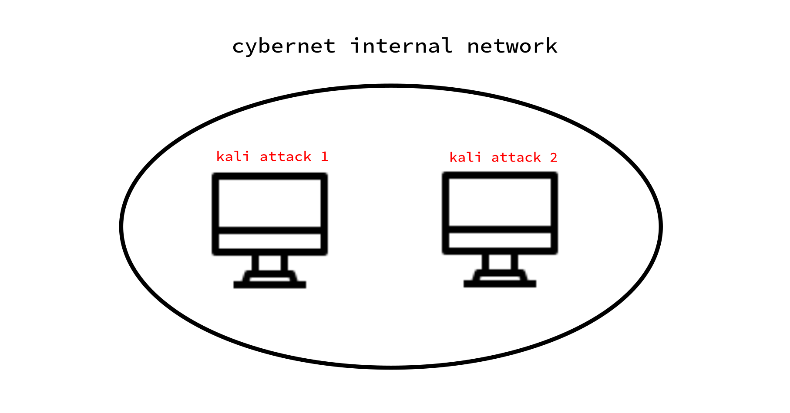

# Cybernet Virtual Lab Project

## Overview

The Cybernet Virtual Lab is an isolated virtual network environment designed for conducting **security case studies** focusing on network attacks and subsequent hardening techniques. This project provides a safe, controlled environment to study various attack vectors, understand their impact, and implement effective defensive measures.

Built using VirtualBox, this lab creates an isolated internal network where cybersecurity professionals, students, and enthusiasts can:
- **Study real-world attack scenarios** in a controlled environment
- **Practice penetration testing techniques** without risking production systems
- **Implement and validate security hardening measures**
- **Develop incident response skills** through hands-on exercises
- **Document and analyze** security vulnerabilities and their mitigations

## Purpose and Goals

This project serves as a practical learning platform for:

1. **Attack Case Studies**: Understanding common attack vectors including:
   - Network reconnaissance and scanning
   - Service enumeration and exploitation
   - Man-in-the-Middle (MITM) attacks
   - Denial of Service (DoS) scenarios
   - Brute force and credential attacks
   - Web application vulnerabilities

2. **Hardening Techniques**: Implementing defensive measures such as:
   - Network segmentation and isolation
   - Firewall configuration and rules
   - Intrusion Detection Systems (IDS) setup
   - Service hardening and configuration
   - Access control and authentication mechanisms
   - Security monitoring and logging

3. **Skills Development**: Building practical cybersecurity competencies through:
   - Hands-on penetration testing
   - Security assessment and auditing
   - Defensive security implementation
   - Security tool proficiency (Nmap, Metasploit, Wireshark, etc.)

## Network Architecture

The lab consists of an **isolated internal network** running on VirtualBox, completely disconnected from the internet. This isolation ensures:
- **Safe experimentation** without external consequences
- **Controlled environment** for reproducible attack scenarios
- **No risk** to production systems or networks
- **Compliance** with ethical hacking principles



### Network Topology

- **Network Name**: cybernet
- **Network Type**: Internal (isolated from host and internet)
- **DHCP Server IP**: 192.168.3.1
- **Subnet**: 192.168.3.0/24
- **DHCP Range**: 192.168.3.2 - 192.168.3.254
- **Virtual Machines**: Kali Linux systems (attacker and target roles)

## Prerequisites

Before setting up this lab, ensure you have:

- **VirtualBox** (version 6.0 or higher) installed on your host system
- **VBoxManage** command-line tool (included with VirtualBox)
- **Kali Linux ISO** or pre-built virtual machine images
- **Minimum Hardware**:
  - 8GB RAM (16GB recommended)
  - 50GB free disk space
  - Multi-core processor with virtualization support (VT-x/AMD-V enabled)
- **Basic Knowledge**:
  - Linux command line
  - Basic networking concepts (IP addressing, subnets, ports)
  - Familiarity with security concepts

## Setup Instructions

### 1. Create the Internal Network

The internal network isolates all VMs from external networks:

```bash
# Create the DHCP server for the isolated network
VBoxManage dhcpserver add --network=cybernet --server-ip=192.168.3.1 --netmask=255.255.255.0 --Lower-ip=192.168.3.2 --upper-ip=192.168.3.254 --enable
```

### 2. Configure Virtual Machines

1. Create or import Kali Linux VMs in VirtualBox
2. Assign each VM to the `cybernet` internal network:
   - Open VM Settings → Network → Adapter 1
   - Enable Network Adapter
   - Attached to: **Internal Network**
   - Name: **cybernet**

3. Boot the VMs and verify they receive DHCP addresses in the 192.168.3.x range

### 3. Verify Network Connectivity

Once both VMs are running, test connectivity:

```bash
# Check IP address assignment
ip addr show

# Test connectivity between VMs
ping <target_vm_ip>

# Perform network scanning
nmap -sn 192.168.3.0/24
```

### 4. Initial Testing

Validate the lab environment with basic network tests:

```bash
# On VM 1: Start a simple HTTP server
python3 -m http.server 8080

# On VM 2: Scan for the open port
nmap -sV -p 8080 <vm1_ip>

# Access the HTTP server
curl http://<vm1_ip>:8080
```

## Usage and Workflows

### Attack Scenario Workflow

1. **Reconnaissance**: Use Nmap, Netdiscover, or similar tools to identify targets
2. **Enumeration**: Gather detailed information about services, versions, and configurations
3. **Exploitation**: Attempt controlled attacks using appropriate tools
4. **Documentation**: Record findings, attack vectors, and success/failure factors
5. **Analysis**: Review logs, network traffic, and system behavior

### Hardening Workflow

1. **Baseline Assessment**: Document initial system and network state
2. **Identify Vulnerabilities**: Use scanning tools to find weaknesses
3. **Implement Controls**: Apply security hardening measures
4. **Verification**: Re-test to confirm vulnerabilities are mitigated
5. **Continuous Monitoring**: Set up logging and monitoring tools
6. **Documentation**: Maintain detailed records of all hardening steps

## Case Study Examples

### Example 1: Network Reconnaissance and Service Hardening

**Attack Phase**:
- Perform network sweep with Nmap
- Identify running services and versions
- Detect potential vulnerabilities

**Hardening Phase**:
- Disable unnecessary services
- Update software to patched versions
- Configure firewall rules to restrict access
- Implement service-specific security configurations

### Example 2: Web Application Security

**Attack Phase**:
- Test for common web vulnerabilities (SQL injection, XSS, etc.)
- Attempt directory traversal
- Test authentication mechanisms

**Hardening Phase**:
- Implement input validation and sanitization
- Configure Web Application Firewall (WAF)
- Enable HTTPS with proper certificates
- Implement strong authentication and session management

## Security Best Practices

### Ethical Considerations

⚠️ **IMPORTANT**: This lab is for educational purposes only.

- **Only attack systems you own or have explicit permission to test**
- **Keep the network isolated** - never connect to production networks
- **Document all activities** for learning and reference
- **Respect privacy and laws** - unauthorized access is illegal
- **Use knowledge responsibly** for defensive security purposes

### Lab Safety

- Regularly snapshot VMs before destructive tests
- Keep the internal network completely isolated
- Don't store sensitive personal data in the lab
- Use separate accounts for lab activities
- Regularly backup your lab configuration

## Tools and Technologies

Common tools used in this lab environment:

- **Network Scanning**: Nmap, Netdiscover, Masscan
- **Packet Analysis**: Wireshark, tcpdump
- **Exploitation**: Metasploit Framework, SearchSploit
- **Web Testing**: Burp Suite, OWASP ZAP, Nikto
- **Password Attacks**: John the Ripper, Hashcat, Hydra
- **Monitoring**: Snort, Suricata, OSSEC

## Troubleshooting

### VMs Cannot Communicate

- Verify both VMs are on the `cybernet` internal network
- Check DHCP server is running: `VBoxManage list dhcpservers`
- Restart VMs to obtain new DHCP leases
- Check firewall rules on both VMs

### DHCP Server Issues

```bash
# List existing DHCP servers
VBoxManage list dhcpservers

# Remove and recreate if needed
VBoxManage dhcpserver remove --network=cybernet
VBoxManage dhcpserver add --network=cybernet --server-ip=192.168.3.1 --netmask=255.255.255.0 --Lower-ip=192.168.3.2 --upper-ip=192.168.3.254 --enable
```

### Performance Issues

- Allocate more RAM to VMs (minimum 2GB per VM)
- Enable hardware virtualization (VT-x/AMD-V) in BIOS
- Use fixed-size disk images instead of dynamically allocated
- Close unnecessary applications on the host system

## Future Enhancements

Planned additions to the lab:

- [ ] Additional VM roles (Windows targets, vulnerable web servers)
- [ ] Pre-configured attack scenarios with documentation
- [ ] Automated deployment scripts
- [ ] Integration with logging and SIEM solutions
- [ ] Network traffic capture and analysis guides
- [ ] Documented case studies with step-by-step walkthroughs

## Learning Resources

- [OWASP Testing Guide](https://owasp.org/www-project-web-security-testing-guide/)
- [Nmap Network Scanning Guide](https://nmap.org/book/)
- [Metasploit Unleashed](https://www.metasploitunleashed.com/)
- [VirtualBox Documentation](https://www.virtualbox.org/manual/)
- [Kali Linux Documentation](https://www.kali.org/docs/)

## Contributing

This is a personal learning project, but suggestions and improvements are welcome. Feel free to:
- Share attack scenarios and hardening techniques
- Suggest additional tools or configurations
- Report issues or improvements

## License

This project is for educational purposes. Please use responsibly and ethically.

---

**Disclaimer**: This lab environment is designed for legal, authorized security testing and educational purposes only. Users are responsible for ensuring their activities comply with all applicable laws and regulations.
